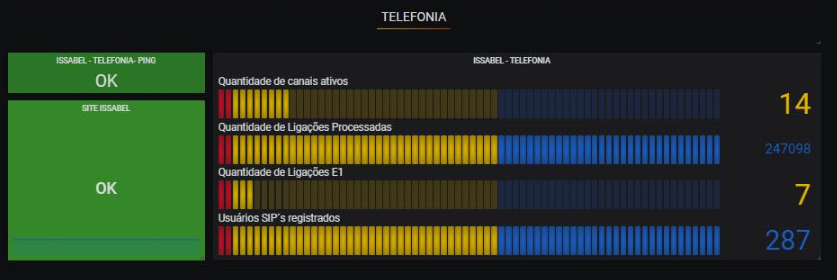

# Grafana monitoring Issabel

* Active Channel Monitoring
* Number of calls processed
* Number of calls on E1
* Registered SIP User

## Lines to be inserted into zabbix agent configuration file.

UserParameter=user.asterisk.active.channels,sudo /usr/sbin/asterisk -rvvvvvx 'core show channels' | grep "active channels" | awk '{print $1}'
UserParameter=user.asterisk.active.calls,sudo /usr/sbin/asterisk -rvvvvvx 'core show channels' | grep "active calls" | awk '{print $1}'
UserParameter=user.asterisk.calls.processed,sudo /usr/sbin/asterisk -rvvvvvx 'core show channels' | grep "calls processed" | awk '{print $1}'
UserParameter=gt1,sudo /usr/sbin/asterisk -rx "sip show peers" | grep "Gateway01" |  awk '{$NR=""; print $6}'
UserParameter=gt2,sudo /usr/sbin/asterisk -rx "sip show peers" | grep "Gateway02" |  awk '{$NR=""; print $6}'
UserParameter=peers,sudo /usr/sbin/asterisk -rx "sip show peers" | grep "online" | cut -b 27-30
